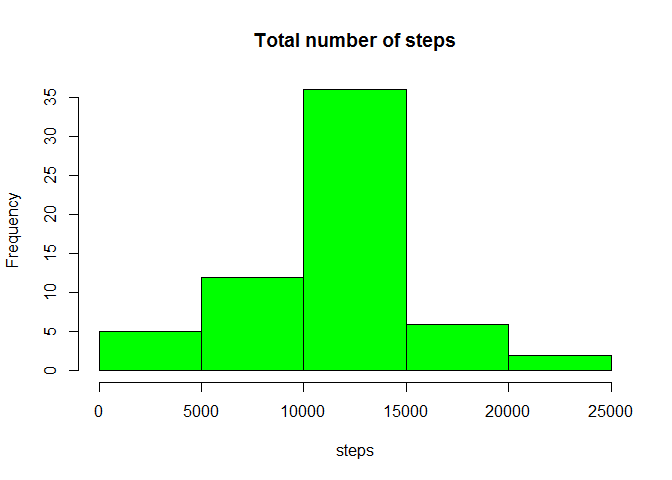
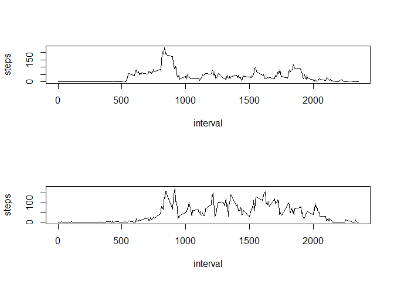

# Reproducible Research: Peer Assessment 1
## Loading and preprocessing the data

```r
#load file and convert columns to correct types
mydata<-read.csv("activity.csv",stringsAsFactors=FALSE)
mydata$date<-as.Date(mydata$date,"%Y-%m-%d")
mydata$steps<-as.numeric(mydata$steps)
mydata$interval<-as.numeric(mydata$interval)
```

## What is mean total number of steps taken per day?

```r
#calculate daily totals, and display as histogram
dailytotal<-aggregate(list(steps=mydata$steps),list(date=mydata$date),sum)
hist(dailytotal$steps,col="green", main="Total number of steps", xlab="steps")
```

 

```r
#print mean and median of daily totals
mean(dailytotal$steps,na.rm=TRUE)
```

```
## [1] 10766.19
```

```r
median(dailytotal$steps,na.rm=TRUE)
```

```
## [1] 10765
```

## What is the average daily activity pattern?

```r
#calculate the mean number of steps for each interval and plot a time series of the data
intervalmean<-aggregate(list(steps=mydata$steps),list(interval=mydata$interval),mean,na.rm=TRUE)
plot(intervalmean$interval,intervalmean$steps,type="l",xlab="interval",ylab="steps",main="Daily Activity Pattern")
```

 
  
The interval with the maximum average of steps is given here

```r
intervalmean$interval[which.max(intervalmean$steps)]
```

```
## [1] 835
```

## Imputing missing values
First we find the total number of NA vlaues in our data

```r
sum(is.na(mydata$steps))
```

```
## [1] 2304
```

We will now replace NA values with the corresponding mean in that interval as calculated in the previous part of the assignment


```r
#get indices of missing data
ind<-which(is.na(mydata$steps))
mydata2<-mydata
#replace misssing data with mean of steps in that interval
mydata2$steps[ind]<-intervalmean$steps[match(mydata$interval[ind],intervalmean$interval)]
#calculate total number of steps for each day with revised data, plot histogram of data and calculate mean and median
mydata2<-aggregate(list(steps=mydata2$steps),list(date=mydata2$date),sum)
hist(mydata2$steps,col="green",xlab="steps",main="Total number of steps")
```

 

```r
mean(mydata2$steps)
```

```
## [1] 10766.19
```

```r
median(mydata2$steps)
```

```
## [1] 10766.19
```
With the new data the mean remains the same, whereas the median approaches the mean

## Are there differences in activity patterns between weekdays and weekends?

```r
#find name of days from date and then replace weekdays with "weekday" and the rest with "weekend"
Sys.setlocale("LC_ALL","English")
```

```
## [1] "LC_COLLATE=English_United States.1252;LC_CTYPE=English_United States.1252;LC_MONETARY=English_United States.1252;LC_NUMERIC=C;LC_TIME=English_United States.1252"
```

```r
wday<-weekdays(mydata$date)
week<-c("Monday","Tuesday","Wednesday","Thursday","Friday")
wday[wday %in% week]<-"weekday"
wend=c("Saturday","Sunday")
wday[wday %in% wend]<-"weekend"
wday<-as.factor(wday)
mydata$wday<-wday
#create two data frames one for weekdays and one for weekend, then calculate the mean number of steps for each 
#interval in both data frames
mydataweek<-mydata[mydata$wday=="weekday",]
mydataweek<-aggregate(list(steps=mydataweek$steps),list(interval=mydataweek$interval),mean,na.rm=TRUE)
mydatawend<-mydata[mydata$wday=="weekend",]
mydatawend<-aggregate(list(steps=mydatawend$steps),list(interval=mydatawend$interval),mean,na.rm=TRUE)
#plot the time series
par(mfrow=c(2,1))
plot(mydataweek$interval,mydataweek$steps,type='l',xlab="interval",ylab="steps")
plot(mydatawend$interval,mydatawend$steps,type='l',xlab="interval",ylab="steps")
```

 
  
  
As we can see there is more activity on weekends than on weekdays
